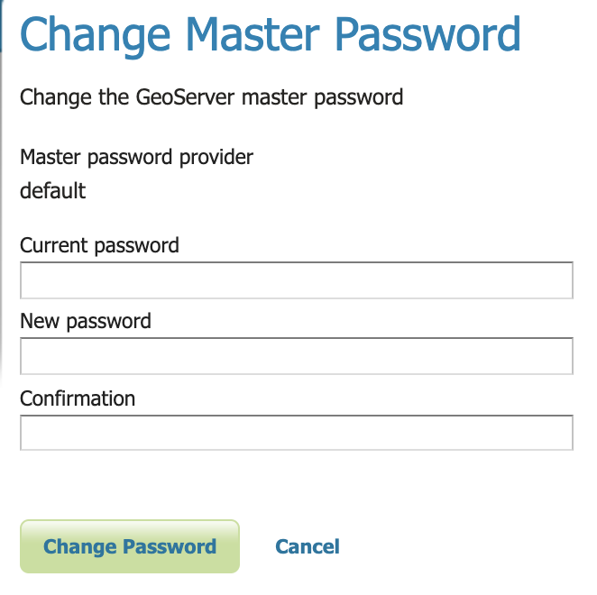
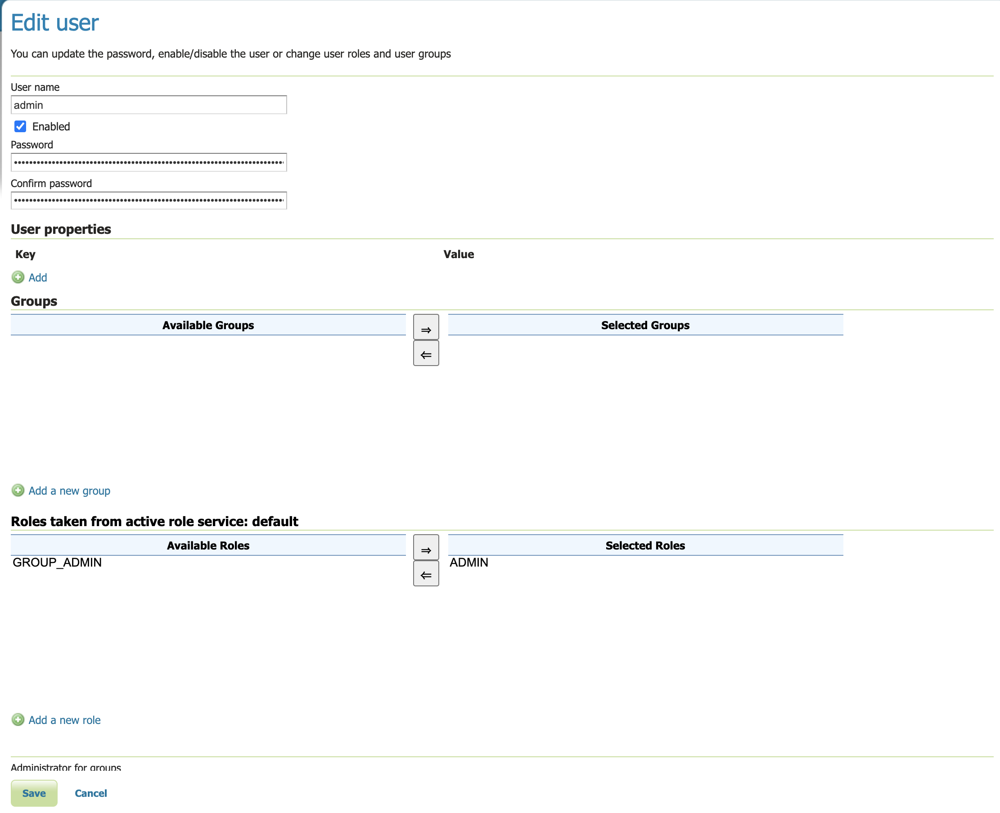
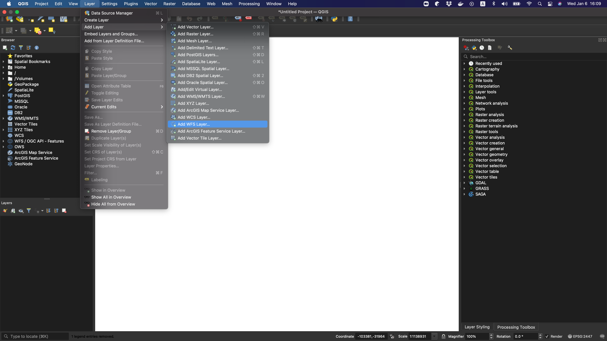
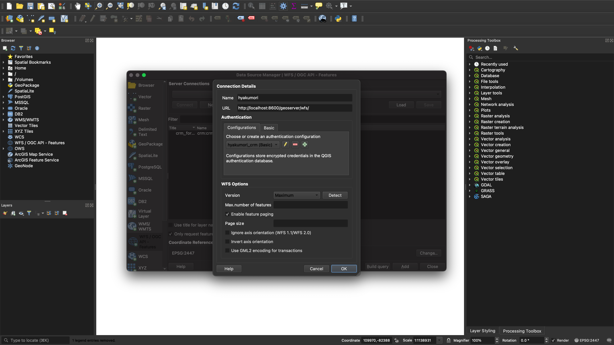
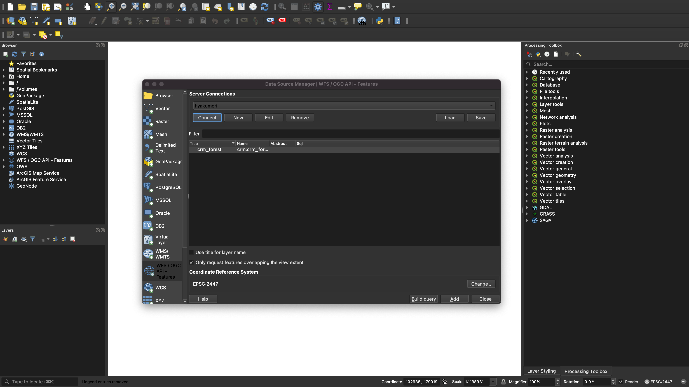
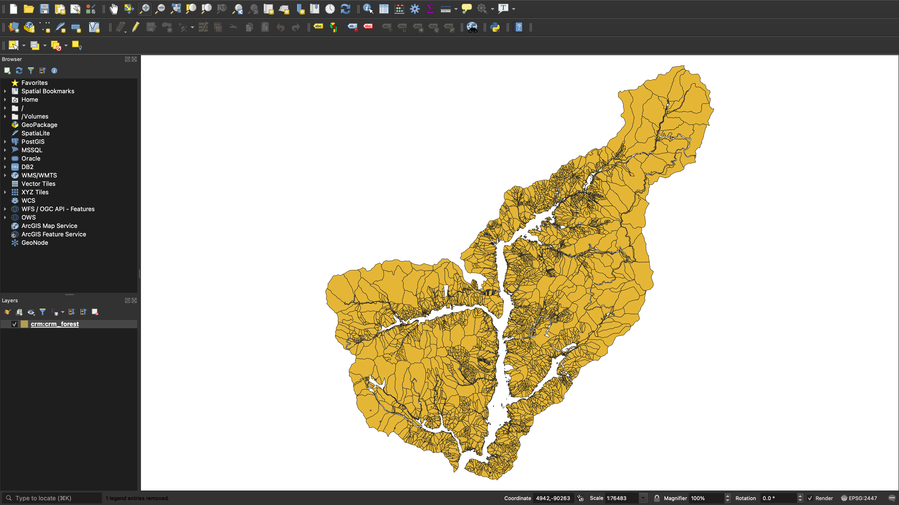

# Setting up Geoserver

Geoserver is launched by `docker-compose`. Once up and running, you can 
 access it by going to http://localhost:8600/geoserver/

General geoserver documentation can be found [here](https://docs.geoserver.org/stable/en/user/rest/workspaces.html).

If setting up or using geoserver for the first time, please change at least the default users password.
 A complete guide to the security settings can be found [here](https://docs.geoserver.org/stable/en/user/security/webadmin/index.html).

Changing the default master password:

and the default user password:

## Add a CRM role

Click on `Users, Groups, Roles` on the left-hand panel to manage user group and role services. Click
 on the `Roles` tab and the `Add new role`. Fill in `CRM` as the name and leave parent role and key
 property pairs blank. Hit save. This role will be applied to the `crm` user to
 manage access to map layers in the CRM.

## Add a CRM user

The CRM will require a user to authenticate in order to fetch protected data from geoserver. This
 user should have limited read only access and the credentials should match the `GEOSERVER_USER`
 and `GEOSERVER_PASS` that is declared in the `.env` file.

Click on `Users, Groups, Roles` on the left-hand panel to manage user group and role services. Click
 on the `Users/Groups` tab and the `Add new user`. Fill in the username and password such that it
 matches the `GEOSERVER_USER` and `GEOSERVER_PASS` that is declared in the `.env` file.
 Select the `CRM` role for this user and click save.

## Setting up Data

This section describes how to get started with geoserver by adding data that will then be served over WMS and WFS.

### Workspaces

We will create three workspaces. One for the CRM, which contains the cadastral vector data, 
 one for the raster data that are used as base maps, and one for the geodata (roads, trees, zones, etc.).

1. Create CRM workspace:
    - Basic Info:
        - name: crm
        - uri: https://100morichan.net
        - Default Workspace: TRUE
    - Security:
        - Allow ADMIN roles full access, CRM and ROLE_AUTHENTICATED roles 
          only read access to the workspace.

Once this has been created, click on it to edit it and select:
    - Settings:
        - Enabled: TRUE
    - Services:
        - WFS
        - WMS

2. Create the raster workspace:
    - Basic Info:
        - name: raster
        - uri: https://github.com/hyakumori/data/tree/main/raster/README.md
        - Default Workspace: FALSE
    - Security:
        - default settings should be OK as some layers may be nice to have open.
Once this has been created, click on it to edit it and select:
    - Settings:
        - Enabled: TRUE
    - Services:
        - WMS

3. Create the geodata workspace:
    - Basic Info:
        - name: geo
        - uri: https://github.com/hyakumori/data/tree/main/vector/README.md
        - Default Workspace: FALSE
    - Security:
        - Allow ADMIN roles full access, AUTHENTICATED_USER roles have read and write, while
          CRM role has only read access to the workspace.

Once this has been created, click on it to edit it and select:
    - Settings:
        - Enabled: TRUE
    - Services:
        - WFS
        - WMS

### Stores

In this documentation, we will only add a few stores for illustration purposes: 
 one for the cadastral data in the crm, one for the geodata, and one for a DEM 
 raster base layer. We will name the cadastral data as `crm_forests` as this matches
 the database table name.

   * crm_forests:
        - select "PostGIS - PostGIS Database" from Vector Data Sources.
        - create the store with the following settings:
            - Workspace: crm
            - Data Source Name: crm_forests
            - Description: hyakumori cadastral data
            - Enabled: TRUE
            - host: postgres
            - port: 5432
            - database: hyakumori_crm
            - schema: public
            - user: postgres
            - passwd: postgres
    
   * geodata:
        - select "PostGIS - PostGIS Database" from Vector Data Sources.
        - create the store with the following settings:
            - Workspace: geo
            - Data Source Name: geodata
            - Description: hyakumori geo data of roads, forest plots, trees, etc.
            - Enabled: TRUE
            - host: postgres
            - port: 5432
            - database: hyakumori_geo
            - schema: public
            - user: postgres
            - passwd: postgres

   * DEM (s3):
        - select "S3GeoTiff - Tagged Image File Format with Geographic 
          information hosted on S3" from Raster Data Sources.
        - create the store with the following settings:
            - Workspace: raster
            - Data Source Name: DEM
            - Description: DEM of the hyakumori area.
            - Enabled: TRUE
            - URL: s3://hyakumori-geodata/base/DEMデータ.tif?awsRegion=AP_NORTHEAST_1
    
_note: the s3 raster is hosted in a private s3 bucket and so it requires an AWS access key. This 
is stored in the .env file but will be in the future on GitHub as a GitHub secret._
    
3. add layers. We will add three layers in this documentation: one for 
   forest vectors (crm_forests store), and the other for one of the raster base maps 
   (raster store).
   * crm_forests:
        - select "add a new layer" to create a new layer from the Layers menu item 
          (this is located in the Data menu heading on the menu bar that is on 
          the left-hand side of the screen).
        - select `crm:crm_forests` as source to add the layer from.
        - click `publish` for `crm_forest`.
        - publish the layer with the following settings:
            - Data:
                - Name: Forests
                - Title: Forests
                - Abstract: Hyakumori customer-owned forests.
                - Native SRS: EPSG:2447
                - Declared SRS: EPSG:2447
                - SRS Handling: Force declared
                - Bounding boxes:
                    - Native Bounding Box: compute from data
                    - Lat/Lon Bounding Box: compute from native bounds
            - Security:
                - Grant read and write access to `ADMIN` and `GROUP_ADMIN` only.
    * DEM:
        - select "add a new layer" to create a new layer from the Layers menu item 
      (this is located in the Data menu heading on the menu bar that is on 
      the left-hand side of the screen).
        - select `raster:DEMデータ` as source to add the layer from.
        - publish layer name `DEMデータ` with the following settings:
            - Data:
                - fill in title, name, and abstract
                - make sure `Enabled` and `Advertised` are selected
                - make sure all SRS settings are correct (all should be EPSG:2447)
                - compute the bounding box size from the data
            - Security:
                - optionally restrict base maps to only admins.
    

## Connect to WFS layer from QGIS:
Use the following instructions to connect to the WFS layer to be able
 to read and write forest vectors to the database.

1. Click "Layer > Add Layer > Add WFS Layer ..."

2. Click `New Connection` and enter the following connection details:

3. This requires creating an authentication configuration. Click the "Plus" icon to 
   add a new configuration (recommended) or create a new "Basic" authentication setting 
   by clicking on the `Basic` tab.
   
4. Enter the following authentication settings then save and click `OK` for the connection details:

You must use admin level credentials for geoserver.

5. Click `Connect` under "Server Connections".

6. Select the layer `crm_forest` and click `Add`.

